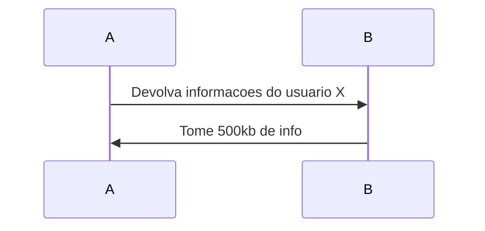

# Estilo de arquitetura X Padrao de arquitetura

Estilo de arquitetura = modo no qual o backend e frontend estao organizados a nivel de codigo (inclui tambem se o deploy eh em monolito ou feito por servicos)

Padrao de arquitetura = Envolve mais questoes de caracteristicas de arquitetura (escalabilidade, performance, elasticidade, etc)

A ideia de toda a segunda parte do livro eh mostrar aos arquitetos padroes comuns de arquitetura encontrados por ai

## Big ball of mud
Quer dizer que o codigo eh uma zona. Nao tem reaproveitamento que preste, ta tudo espalhado. Da pra ver que o codigo cresceu a torto e a direita. Tambem eh possivel dizer que esse eh o tipico codigo "espaguetti", onde o rastreio do fluxo eh muito complexo de ser feito.

Esse tipo de padrao eh uma **merda** quanto mais voce puder evitar de encontrar isso, melhor

## Unitary Archtecture
Significa que computador e software sao um so, esse padrao quase nao existe hoje em dia pois trata de tudo apenas rodando local (isso mesmo, eh desenvolver e rodar somente em 1 maquina localmente). Isso acontecia bastante na epoca do mainframe mas eh extramemamente raro nos dias de hoje

## Client / Server
Essa eh um classico. Surgiu conforme a internet avancava e foram notando que dava pra separar o processamento do que o cliente via em tela. Algumas variacoes desse modo sao

- Desktop + database
- Browser + servidor web

# Sistemas distribuidos X sistemas monoliticos
Eh comum as vezes nos pensarmos que sistemas distribuidos sao balas de prata (principalmente pela nossa historia particular onde todos os clientes que trabalhos ate 2024 possuiam sistemas distribuidos em sua arquitetura)

Mas isso nao eh verdade, sistemas distribuidos tem suas fraquezas e elas devem ser levadas em consideracao nesses casos. Abaixo abordaremos as **8 falacias sobre sistemas distribuidos**

## #1 A internet eh confiavel
A internet (como conexao entre computadores) a cada dia que passa ela se torna mais resiliente mas mesmo assim ela nao pode ser considerada confiavel. Eh comum que ocorram perdas de pacotes, lentidao na comunicacao, perda de contato com o servidor, etc.

Quando trabalhamos com sistemas distribuidos eh sempre importante ter em mente que precisaremos em todos os nossos sistemas conectados adicionar niveis de tolerancia a falhas (como timeouts e circuit breakers por exemplo). Isso acaba por elevar um pouco a complexidade do projeto

## #2 A latencia eh zero
Eh um fato obvio mas que muita gente ignora eh que quando adicionamos mais conexoes externas em nosso sistema precisamos levar em conta a latencia da internet. Se colocarmos o sistema todo dentro de um monolito ele sempre tera um tempo de resposta menor que se estiver em microsservicos.

Eh importante quando lidar com varias conexoes de rede entender o pq aquela determinada chamada esta demorando aquele tempo.

*O resultado final de tempo de resposta eh a soma de todos os tempos de resposta que cada microsservico te retornou*

## #3 Largura de banda eh infinita
A internet possui um limite fisico de dados que conseguem ser trafegados no cabo (o limite varia do quao caro eh o cabo). Uma coisa que o pessoal sempre desconsidera na hora de criar microsservicos (MS) eh que a mensagem vai ter que trafegar na rede, e existe sempre um custo / investimento que precisa ser feito pra aguentar esse tranco. Exemplo:

1 pessoa requisita 500kb de informacao, se tivermos 2000 requisicoes por segundo isso significa **1Gb** de informacao passando no cabo por segundo **para apenas 1 MS**

## #4 A internet eh segura
Aqui entra o tema da superficie de ataque, em um monolito voce so tem muitas vezes 1 unico ponto de entrada, enquanto em um sistema distribuido voce tem N pontos de entrada

## #5 A topologia nunca muda
Essa falacia leva em consideracao a mudanca da topologia de rede. Na minha opiniao isso pode acabar acontecendo tambem em sistemas monoliticos mas o ponto todo aqui eh que se o sistema distribuido tiver muitas nuances, muitas divisoes e cada uma cuidada por uma equipe de redes diferente isso pode ocasionar problemas com mais facilidade

## #6 So existe 1 administrador
Uma rede em empresas grandes tem varios administradores. O que significa que em sistemas distribuidos o pessoal tem uma superficie maior para olhar, o que acarreta em mais pessoas contratadas, o que significa que o arquiteto tera um trabalho maior em alinhar com todo mundo o que foi feito / o que vao fazer

## #7 Nao existe custo de transporte
Aqui eh basicamente o custo envolvido na falacia #2, se voce precisar trafegar muita coisa na rede vai precisar ter uma infra muito boa e isso significa $$$

## #8 A rede eh homogenea
A rede de uma empresa possui varias marcas (Cisco, HP, Juniper, etc). Por mais que existem padroes a serem seguidos eh natural que essas marcas nao se comuniquem 100%, o que basicamente pode acarretar em todas as falacias descritas ate aqui