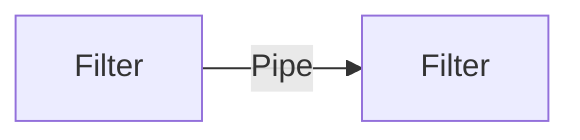

Essa arquitetura se tornou famosa a partir do momento em que arquitetos e desenvolvedores comecaram a dividir as funcionalidades em partes ainda menores. Essa ideia de pipeline deriva de shells Unix onde podemos facilmente colocar um comando sendo input de outro e assim realizar as mais diversas operacoes em tratamentos de dados.

Esse tipo de arquitetura possui sua comum utilizacao em ambientes que devemos apenas tratar unidirecionalmente a informacao e depois manipular ela (como o proprio bash do Unix por exemplo)

# Pipes
Canal de comunicacao entre os _filters_. Eles geralmente sao unidirecionais e apontam apenas para 1 filter (por questoes de performance). No fim ficam mais ou menos assim:

# Filters
Pedacos do codigo que executam uma tarefa.

Tipos de filtro:
- Producers
- Transformer
- Tester
- Consumer

## Producers
Inicio de todo o fluxo de processamento, tambem eh conhecido como **source**

## Transformer
Aceita um input e transforma ele de acordo com o solicitado, tambem conhecido como **map**

## Tester
Aceita um input e verifica se ele esta ou nao de acordo com as validacoes esperadas. Nao obrigatoriamente devolve output. Tambem conhecido como **map**

## Consumer
A ponta final do fluxo de pipeline, eles podem ou nao armazenar essa informacao

# Pq usar esse tipo de arquitetura?
Barata, simples e modular. Geralmente encontrada em monolitos. A modularidade eh atingida devio ao **separation of concerns** que existe aqui (tendo em vista que separamos entre os 4 tipos diferentes de _filters_)

Por ser encontrada em monolitos precisa tomar cuidado em relacao a deploy, testes e agilidade.